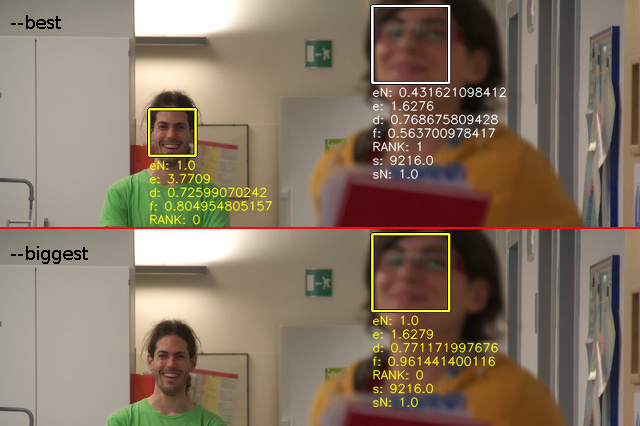

facedetect: a simple face detector for batch processing
=======================================================

`facedetect` is a simple face detector for batch processing. It answers the
basic question: "Is there a face in this image?" and gives back either an exit
code or the coordinates of each detected face in the standard output.

The aim is to provide a basic command-line interface that's consistent and easy
to use with software such as ImageMagick_, while progressively improving the
detection algorithm over time.

`facedetect` is used in software such as fgallery_ to improve the thumbnail
cutting region, so that faces are always centered.

Basic Usage
-----------

By default `facedetect` outputs the rectangles of all the detected faces::

  ./facedetect path/to/image.jpg
  289 139 56 56
  295 283 55 55

The output values are the X Y coordinates (from the top-left corner),
followed by width and height. For debugging, you can examine the face positions
directly overlaid on the source image using the ``-o`` flag::

  ./facedetect -o test.jpg path/to/image.jpg

To simply check if an image contains a face, use the ``-q`` switch and check
the exit status::

  ./facedetect -q path/to/image.jpg
  echo $?

An exit status of 0 indicates the presence of at least one face. An exit status
of 2 means that no face could be detected (1 is reserved for failures).

The ``--center`` flag also exists for scripting convenience, and simply outputs
the X Y coordinates of face centers::

  ./facedetect --center path/to/image.jpg
  317 167
  322 310

The ``--biggest`` flag only outputs the biggest face in the image, while
``--best`` will attempt to select the face in focus and/or in the center of the
frame.

  Comparison between ``--best`` (top) and ``--biggest`` (bottom). The
  chosen face is highlighted in yellow.

Unless DOF or motion blur is used effectively by the photographer to separate
the subject, ``--biggest`` would in most cases select the same face as
``--best``, while being significantly faster to compute.

Examples
--------

Sorting images with and without faces
~~~~~~~~~~~~~~~~~~~~~~~~~~~~~~~~~~~~~
The following example sorts pictures into two different "landscape"
and "people" directories using the exit code::

  for file in path/to/pictures/*.jpg; do
    name=$(basename "$file")
    if facedetect -q "$file"; then
      mv "$file" "path/to/people/$name"
    else
      mv "$file" "path/to/landscape/$name"
    fi
  done

Blurring faces within an image
~~~~~~~~~~~~~~~~~~~~~~~~~~~~~~
The following example uses the coordinates from `facedetect` to pixelate the
faces in all the source images using `mogrify` (from ImageMagick_)::

  for file in path/to/pictures/*.jpg; do
    name=$(basename "$file")
    out="path/to/blurred/$name"
    cp "$file" "$out"
    facedetect "$file" | while read x y w h; do
      mogrify -gravity NorthWest -region "${w}x${h}+${x}+${y}" \
	-scale '10%' -scale '1000%' "$out"
    done
  done

Here ``mogrify`` is called for each output line of `facedetect` (which is
sub-optimal), modifying the file in-place.

Extracting all faces to separate images
~~~~~~~~~~~~~~~~~~~~~~~~~~~~~~~~~~~~~~~
The following example uses ``convert`` from ImageMagick_ to extract each
face in each source image ``img.jpg`` to a separated image ``img_N.jpg``::

  for file in path/to/pictures/*.jpg; do
    name=$(basename "$file")
    i=0
    facedetect "$file" | while read x y w h; do
      convert "$file" -crop ${w}x${h}+${x}+${y} "path/to/faces/${name%.*}_${i}.${name##*.}"
      i=$(($i+1))
    done
  done

Searching for a face
--------------------

`facedetect` has some naïve support to search for a specific face as supplied
with the ``-s`` file argument. The file provided must be an image containing
preferably a *single* face. `facedetect` will then compare all faces against
it, and output only the matches which are above the requested similarity
threshold (30% by default).

When face search is used with ``-q`` (query), and exit status of 0 is only
emitted if there is at least one face matching the requested template.

The similarity threshold can be controlled with ``--search-threshold``, which
is a value between -100 and 100, with greater values resulting in greater
similarity. The current matching algorithm is based on simple MSSIM which is
far from perfect (see `Development status and ideas`_).

Dependencies
------------

The following software is currently required for `facedetect`:

- Python
- Python OpenCV (``python-opencv``)
- OpenCV data files (``opencv-data`` if available, or ``libopencv-dev``)

On Debian/Ubuntu, you can install all the required dependencies with::

  sudo apt-get install python python-opencv libopencv-dev

and then install `facedetect` with::

  sudo cp facedetect /usr/local/bin

Development status and ideas
----------------------------

Currently `facedetect` is not much beyond a simple wrapper over the Haar
Cascade classifier of OpenCV and the ``frontalface_alt2`` profile, which
provided the best results in terms of accuracy/detection rate for the general,
real life photos at my disposal.

In terms of speed, the LBP classifier was faster. But while the general theory
states that it should also be more accurate, the ``lbp_frontalface`` profile
didn't provide comparable results, suggesting that additional training is
necessary. If some training dataset is found though, creating an LBP profile
would probably be a better solution especially for the processing speed.

``haar_profileface`` had too many false positives in my tests to be usable.
Using it in combination with ``haar_eye`` (and other face parts) though, to
reduce the false positive rates and/or rank the regions, might be a very good
solution instead.

Both LBP and Haar don't play too well with rotated faces. This is particularly
evident with "artistic" portraits shot at an angle. Pre-rotating the image
using the information from a Hough transform might boost the detection rate in
many cases, and should be relatively straightforward to implement.

Face matching has the interface that user's expect ("find me *this* face"), but
doesn't work as it should. Faces are currently compared using pairwise MSSIM,
which is a far cry from proper face segmentation. MSSIM will only find faces
that have comparable orientation, expression and lighting conditions. HAAR
features do not provide the positioning accuracy required to perform even the
simplest face segmentation operations, such as inter-eye distance.
Interestingly, computing a score using 1:1 SIFT feature matches performed even
worse than plain MSSIM (not enough granularity in most scenarios). Building a
GUI on top of facedetect to train SVM models (which can then be fed back to
``-s``) seems a better way to go given the far greater accuracy, but somehow
deviates from the original intention of unsupervised search.

Authors and Copyright
---------------------

`facedetect` can be found at https://www.thregr.org/~wavexx/software/facedetect/

| `facedetect` is distributed under GPLv2+ (see COPYING) WITHOUT ANY WARRANTY.
| Copyright(c) 2013-2016 by wave++ "Yuri D'Elia" <wavexx@thregr.org>.

facedetect's GIT repository is publicly accessible at::

  git://src.thregr.org/facedetect

or at https://github.com/wavexx/facedetect

.. _ImageMagick: http://www.imagemagick.org
.. _fgallery: https://www.thregr.org/~wavexx/software/fgallery/
